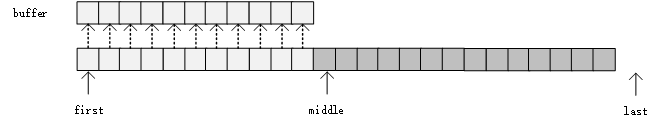
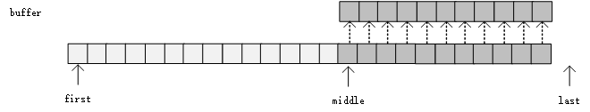

本文以libstdc++的源码作为参考，分析stl中，sort，stable_sort以及list.sort的实现。gcc具体版本不太记得清楚了，看changelog的上次更新是`2018-07-05`。这个时候的stl版本支持到c++17。

## sort

sort()是不稳定的，它综合了快排、堆排和插入排序三种算法，并做了一定优化。相比于c库的qsort，我更推荐使用stl的sort，因为它能够将用户自定义的比较函数内联展开，以得到更好的性能。

影响sort()的使用哪个排序算法的因素主要有两个，分别是数组的长度N和递归深度depth，其中，N的下限是16， depth的上限是`log2（N）*2`.

sort算法的流程如下：

- 首先，按照快排的方式递归
  - 若当前数组范围长度N小于16，直接返回。
  - 若当前递归深度depth超过了上限，说明快排的partition不太合理导致了递归恶化，将当前数组范围内的所有元素直接进行堆排序。
  - 否则，将当前范围内的元素进行一次快排的partition，将当前范围分为两个新的子范围，递归向下。
- 现在，数组大部分是有序的了，对数组进行一次插入排序。

对应以上流程，现在开始分析源码。为了方便阅读，以下源码省略了模板参数等乱七八糟的东西，变量名也删除了下划线前缀。

<!-- more -->

首先是入口，sort函数调用__sort进行排序，该函数代码如下。

```c++
void __sort(RandomAccessIterator first, RandomAccessIterator last, Compare comp)
{
    if (first != last)
    {
        //快排的递归向下
    	std::introsort_loop(first, last, lg(last - first) * 2, comp);
        //对整体数组进行的插入排序
    	std::final_insertion_sort(first, last, comp);
    }
}
```

`introsort_loop`函数的代码如下。不同于我们自己写快排时，对于patition出来的两个子数组会有各有一次递归调用，`introsort_loop`函数使用了循环替代了其中一个递归调用。

```c++
void introsort_loop(RandomAccessIterator first, RandomAccessIterator last, Size depth_limit, Compare comp)
{
    //判断当前数组长度是否大于S_threshold（其值为16）
    while (last - first > S_threshold)
    {
        //判断递归下降的深度
        if (depth_limit == 0)
        {
            //如果递归层数太多，说明快排已经不太有效
            //此时直接使用堆排序
            std::partial_sort(first, last, last, comp);
            return;
        }
        --depth_limit;
        //进行一次patition，pivot从数组开头，结尾和中间三者中选次大值
        RandomAccessIterator cut = unguarded_partition_pivot(first, last, comp);
        //对后半部分数组递归进行排序
        introsort_loop(cut, last, depth_limit, comp);
        //将前半部分数组当做循环的下一轮数组进行排序
        //本质上使用循环代替递归
        last = cut;
    }
}
```

`final_insertion_sort`函数是略带一点优化的插入排序，其源码没有多大的分析价值。

## stable_sort

stable_sort()是stl提供的稳定的排序算法，它综合了归并排序和插入排序，是TIMsort的一个实现。stable_sort的实现的核心在于，在不同buffer大小下，merge的实现方式。

在描述stable_sort的具体流程前，我们先说明在不同buffer大小下merge的流程。

### merge流程

#### 带充足buffer的merge

如果`buffer大小 >= 待merge数组的总大小`，那么merge就很简单了。只需要不断将两个待merge数组中较小的数复制到buffer中即可。

#### 不充足buffer的merge

stl分配的用于merge的buffer大小，有着一个上限。因此会出现`buffer的大小 <= 待merge数组的总大小`这种情况。

此时，根据buffer的大小，还要细分为两种情况进行讨论，在这之前，我们记`[first, middle)`作为第一个待merge的数组（数组1），它的长度为len1，`[middle, last)`作为第二个被merge的数组（数组2），它的长度为len2。

##### 使用较小buffer的merge

当`buffer.size() >= min(len1, len2)`时，如果`len1<=len2`，先将数组1的元素拷贝到buffer中，然后再从前往后，将buffer中的元素与[middle, last)范围内的数据merge到[first, last)范围内。merge的时间复杂度是O(len1+len2)。


如果`len1>len2`，将数组2的元素拷贝到buffer中，然后从后往前，进行merge。



总的来说，只要buffer能够容纳其中一个数组，就能够以O(len1+len2)的复杂度进行merge。

##### 不使用buffer的merge

当`buffer.size() < min(len1, len2)`时，如果`len1>len2`，先将len1对半分割，得到数组1的中间部分的位置为first_cut。然后根据first_cut的值去数组2中找到第一个大于`*first_cut`的值对应的位置(lower_bound)，记为second_cut。如下图所示：


现在，`[middle, second_cut)`范围内的元素一定小于等于`[first_cut, middle)`，将这两个范围内的元素进行旋转，得到new_middle，即`first_cut+(second_cut - middle)`的值。


接下来再对[first, first_cut)和[first_cut, new_middle)范围内的数据递归地进行merge，同样，对于[new_middle, second_cut)和[second_cut, last)范围内的数据也要递归地进行merge。递归地进行merge时，在实现上有所差别。当buffer是真的分配不出来，长度确实为0时，则递归调用自身。但是，如果是buffer分配出来了，但小于两个待merge数组，那么经过这次旋转调整以后，说不定它的buffer长度就长于某个待merge数组了，这时候可以退化到另外两种merge情况中去。

如果`len1<len2`，思路是一样的，只是将len2对半分割，而不是len1，接下来去数组1中找到第一个大于等于*second_cut的值对应的位置，同样进行旋转，接下来的流程略。

至于旋转的代码实现，这又是另一个复杂的问题了。

### stable_sort流程

直接给出整体流程，会把人绕晕。我们先给出拆解出来的各个部分的子流程，最后再把它们综合起来。

#### inplace_stable_sort

`inplace_stable_sort`这个函数是在完全不使用buffer的情况下进行的merge sort。它所使用的merge函数称为`merge_without_buffer`。

`merge_without_buffer`函数对应上文中提到的不使用buffer的merge流程。当它将数组旋转调整后，对更小范围内（如[first, first_cut)和[first_cut, new_middle)范围）的元素进行merge时，它递归调用自身。

`inplace_stable_sort`的流程如下：

- 如果待排序的元素小于15个，直接进行插入排序后返回。
- 否则，二分数组，对二分出来的每一部分递归调用inplace_stable_sort使该部分有序。
- 接下来，对于划分出来的两个部分，调用`merge_without_buffer`对其进行合并。

#### merge_sort_with_buffer

`merge_sort_with_buffer`这个函数是在`buffer大小 >= 待merge数组的总大小`时进行的merge sort。和我们自己写的简单的merge sort相比，它做了一些优化。具体流程如下：

- 首先，对于数组内的元素，每7个一组，组内调用插入排序使得组内有序。
- 接下来，以循环替代递归进行merge sort。先定义一个变量step_size，表示每次循环时，以step_size个元素为一组进行处理，step_size的初始值为7。循环结束条件是step_size大于数组总大小。每次循环内部也有优化，具体如下：
  - 先按照step_size为一组，每两组之间调用`move_merge`函数进行一次merge。`move_merge`是按照上文中提到的带充足buffer的merge所实现的函数。
  - 现在，所有的元素都merge到了buffer中。
  - step_size二倍增长。
  - 接下来，将buffer中所有的元素，再次以step_size为一组，每两组之间进行一次`move merge`。
  - 现在，buffer中元素又以merge的形式被拷贝到了原数组中。
  - step_size再次二倍增长。

#### stable_sort_adaptive

`stable_sort_adaptive`与`inplace_stable_sort`相对，在有buffer情况下进行merge sort。它所使用的merge函数称为`merge_adaptive`。

和inplace_stable_sort`所使用的`merge_without_buffer`所不同的是，当`merge_adaptive`将数组旋转调整后，对更小范围内（如[first, first_cut)和[first_cut, new_middle)范围）的元素进行merge时，当它检测到[first, first_cut)和[first_cut, new_middle)这两部分中任意一部分的元素个数可以被buffer容纳下时，它将进行 使用较小buffer的merge 中描述的流程进行merge，而不再是递归调用自身。

`stable_sort_adaptive`的流程如下：

- 将数组二分。
- 如果二分后子数组的长度大于buffer大小，则对每个子数组递归调用`stable_sort_adaptive`，使子数组有序。
- 否则，对每个子数组调用`merge_sort_with_buffer`使其有序。
- 现在，两个子数组有序了。调用`merge_adaptive`对两个子数组进行合并。

#### stable_sort的整体流程

在描述完一系列的merge sort的实现后，我们终于可以给出stable_sort的整体流程了。

- 首先，尝试分配与数组相同大小的buffer
- 如果buffer分配完全失败，即buffer大小为0，这调用`inplace_stable_sort`。
- 否则， 调用`stable_sort_adaptive`

### 源码分析

我们按照stable_sort流程中，拆解出来每一个部分，依次解释源码的实现。

#### inplace_stable_sort

```c++
// [first, last)区间为待排序区间
void inplace_stable_sort(RandomAccessIterator first,
            RandomAccessIterator last, Compare comp)
{
    if (last - first < 15){
        //元素个数小于15时，直接插入排序并返回
        std::insertion_sort(first, last, comp);
        return;
    }
    //二分并递归调用自身，使得子数组有序
    _RandomAccessIterator middle = first + (last - first) / 2;
    std::inplace_stable_sort(first, middle, comp);
    std::inplace_stable_sort(middle, last, comp);
    //不带buffer的merge操作
    std::merge_without_buffer(first, middle, last,
                middle - first,last - middle,comp);
}
```
merge_without_buffer的源码如下：
```c++
void merge_without_buffer(BidirectionalIterator first,
            BidirectionalIterator middle,
            BidirectionalIterator last,
            Distance len1, Distance len2,
            Compare comp)
{
    //临界条件判断，用于递归结束
    if (len1 == 0 || len2 == 0)
        return;

    if (len1 + len2 == 2)
    {
        if (comp(middle, first))
        std::iter_swap(first, middle);
        return;
    }

    BidirectionalIterator first_cut = first;
    BidirectionalIterator second_cut = middle;
    Distance len11 = 0;
    Distance len22 = 0;
    if (len1 > len2)
    {
        //对数组进行旋转调整
        len11 = len1 / 2;
        std::advance(first_cut, len11);
        second_cut
        = std::lower_bound(middle, last, *first_cut,
                    gnu_cxx::ops::iter_comp_val(comp));
        len22 = std::distance(middle, second_cut);
    }
    else
    {
        //另一种情况下的旋转调整
        len22 = len2 / 2;
        std::advance(second_cut, len22);
        first_cut
        = std::upper_bound(first, middle, *second_cut,
                    gnu_cxx::ops::val_comp_iter(comp));
        len11 = std::distance(first, first_cut);
    }

    BidirectionalIterator new_middle = std::rotate(first_cut, middle, second_cut);
    //现在需要被merge的范围缩小了，继续递归调用自身进行merge
    std::merge_without_buffer(first, first_cut, new_middle,
                len11, len22, comp);
    std::merge_without_buffer(new_middle, second_cut, last,
                len1 - len11, len2 - len22, comp);
}
```
#### merge_sort_with_buffer

```c++
void merge_sort_with_buffer(RandomAccessIterator first,
                RandomAccessIterator last,
                Pointer buffer, Compare comp)
{

    const Distance len = last - first;
    const Pointer buffer_last = buffer + len;

    //_S_chunk_size=7
    Distance step_size = _S_chunk_size;
    //每7个一组，进行组内插入排序
    std::chunk_insertion_sort(first, last, step_size, comp);

    while (step_size < len)
    {
        //每step_size个一组，两组之间进行合并
        //元素从原数组拷贝到buffer
        std::merge_sort_loop(first, last, buffer,
                    step_size, comp);
        step_size *= 2;
        //元素从buffer拷贝到原数组
        std::merge_sort_loop(buffer, buffer_last, first,
                    step_size, comp);
        step_size *= 2;
    }
}
```

#### stable_sort_adaptive

```c++
void stable_sort_adaptive(RandomAccessIterator first,
            RandomAccessIterator last,
            Pointer buffer, Distance buffer_size,
            Compare comp)
{
    const Distance len = (last - first + 1) / 2;
    const RandomAccessIterator middle = first + len;
    if (len > buffer_size)
    {
        //对每个子数组递归调用stable_sort_adaptive，使子数组有序
        std::stable_sort_adaptive(first, middle, buffer, buffer_size, comp);
        std::stable_sort_adaptive(middle, last, buffer, buffer_size, comp);
    }
    else
    {
        //每个子数组调用merge_sort_with_buffer使其有序
        std::merge_sort_with_buffer(first, middle, buffer, comp);
        std::merge_sort_with_buffer(middle, last, buffer, comp);
    }
    //现在，两个子数组有序了。调用merge_adaptive对两个子数组进行合并
    std::merge_adaptive(first, middle, last,
            Distance(middle - first),
            Distance(last - middle),
            buffer, buffer_size, comp);
}
```

```c++
void merge_adaptive(BidirectionalIterator first,
		     BidirectionalIterator middle,
		     BidirectionalIterator last,
		     Distance len1, Distance len2,
		     Pointer buffer, Distance buffer_size,
		     Compare comp)
{
    //前半部分短，而且buffer能装下前半部分
    if (len1 <= len2 && len1 <= buffer_size)
    {
        //把前半部分拷贝到buffer里面去
        Pointer buffer_end = _GLIBCXX_MOVE3(first, middle, buffer);
        //进行merge
        std::move_merge_adaptive(buffer, buffer_end, middle, last,
                        first, comp);
    }
    else if (len2 <= buffer_size)
    {
        //拷贝后半部分到buffer并进行merge
        Pointer buffer_end = _GLIBCXX_MOVE3(middle, last, buffer);
        std::move_merge_adaptive_backward(first, middle, buffer,
                            buffer_end, last, comp);
    }
    else
    {
        //旋转并调整
        ...
        //递归调用自身，对更小范围内的元素进行merge
        std::merge_adaptive(first, first_cut, new_middle, len11,
                len22, buffer, buffer_size, comp);
        std::merge_adaptive(new_middle, second_cut, last,
                len1 - len11,
                len2 - len22, buffer,
                buffer_size, comp);
    }
}
```

## list.sort

stl的链表排序，不要调用`std::sort`，而是要调用它的成员函数sort。具体的原因可以参考《effective stl》。

链表也可以进行快排或者归并排序，libstdc++中，用的是归并排序。

作为stl库，链表的归并排序肯定是不能用递归实现的，取而代之的是由64个链表头构成的数组实现的循环。具体流程如下：

- 如果链表为空或者只有一个节点，则直接返回。
- 否则，每一轮循环从链表中取下一个节点，放到一个称为carry的链表中，直到原链表为空。
  - 每一轮循环中，从0号链表头开始往后遍历。
    - 如果当前链表头为空，则carry链表放到该链表头中，然后循环结束。
    - 否则，carry链表将当前链表头持有的链表合并，然后当前链表头置空。
- 现在，从0号链表头开始，将其中所有的链表合并起来。最终所得到的链表即为排序后的链表。

以一个简单的例子来描述上述的流程。比如我们的链表为`[4,7,3,1,5,2]`，

- 第一轮循环，0号链表持有`[4]`
- 第二轮循环，1号链表持有`[4,7]`，0号链表为`[]`
- 第三轮循环，1号链表持有`[4,7]`，0号链表为`[3]`
- 第四轮循环，2号链表持有`[1,3,4,7]`，1号链表为`[]`，0号链表为`[]`
- 第五轮循环，2号链表持有`[1,3,4,7]`，1号链表为`[]`，0号链表为`[5]`
- 第六轮循环，2号链表持有`[1,3,4,7]`，1号链表为`[2,5]`，0号链表为`[]`

循环结束后，将0、1、2共3号链表合并起来，得到`[1,2,3,4,5,7]`

### 源码分析

实际上，stl的源码实现比我们上面描述的流程稍微复杂些。它还有一个名为fill的链表头指针，指向最大的不为空的链表头的下一个链表头。

```c++
void list::sort()
{
    //排除掉链表节点个数为0和1的情况。
    if (this->impl.node.next != &this->impl.node
    && this->impl.node.next->next != &this->impl.node)
    {
        list carry;
        list tmp[64];
        list * fill = tmp;
        list * counter;
        do
        {
            //取下this的第一个节点，放到carry链表中
            carry.splice(carry.begin(), *this, begin());

            for(counter = tmp;
                //counter到达fill节点时或者counter指向的链表为空时，都表明可以容纳carry链表。
                counter != fill && !counter->empty();
                ++counter)
            {
                //这两步将当前链表头持有的链表（即counter），和carry链表进行合并，其结果放到carry链表中。
                counter->merge(carry);
                carry.swap(*counter);
            }
            //将carry链表放到counter指向的链表头中。
            carry.swap(*counter);
            //更新fill
            if (counter == fill)
            ++fill;
        }
        while (!empty());
		//将tmp上从0到fill上所有的链表进行合并。合并的结果放到(fill-1)所指向的链表头中
        for (counter = tmp + 1; counter != fill; ++counter)
            counter->merge(*(counter - 1));
        //与(fill-1)所指向的链表头进行交换，this就能拿到最终结果了。
        swap( *(fill - 1) );
    }
}

```

