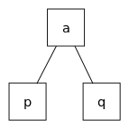
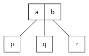
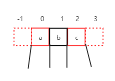
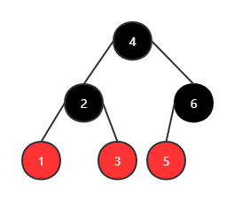
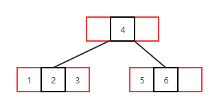
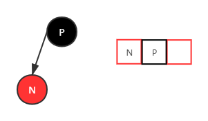
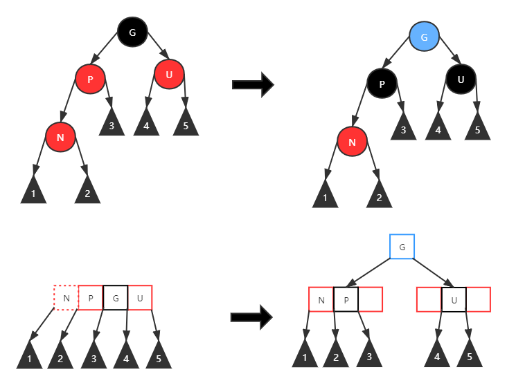
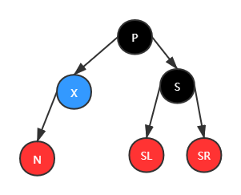
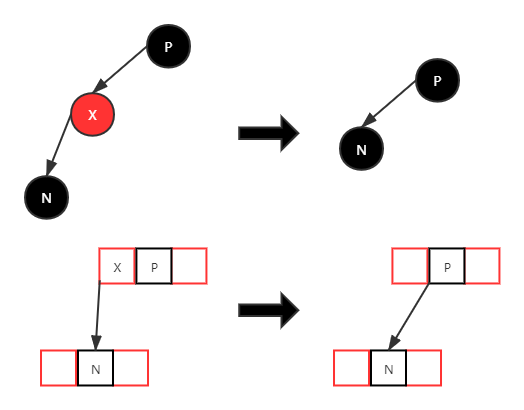
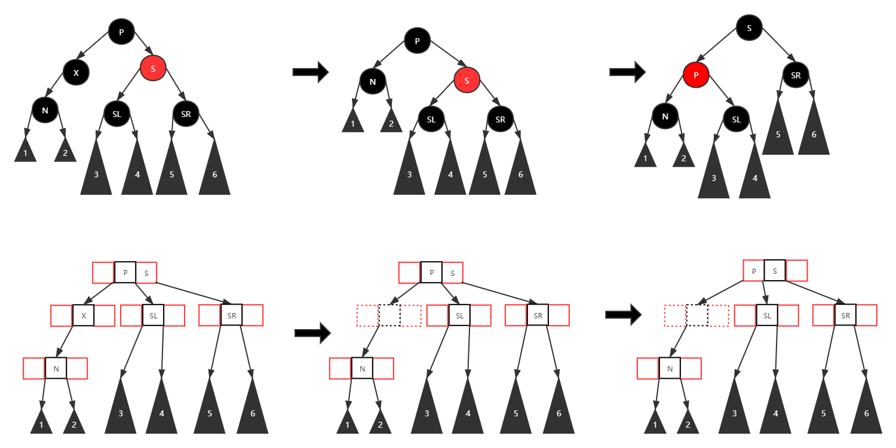

红黑树这个数据结构，用得很多，但是真正细致了解它的比较少。它的各种旋转规则都比较怪异，理解起来较为困难。不过，2-3-4树和红黑树是等价的。为了能够真正理解红黑树各种平衡规则的背后原理，我研究了2-3-4树，并将每一种情况与红黑树对应了起来，总结出了这篇文章。

<!-- more -->

## 2-3-4树

2-3-4树其实是4阶的B树，它每个节点的子节点个数可以是2、3或者4个。2-3-4树最重要的一个特性就是它的树高始终是平衡的。维基百科上对2-3-4树节点的定义如下：

2-node：一个key，两个子节点

3-node：两个key，三个子节点

4-node：三个key，四个子节点

为了与红黑树的旋转平衡等操作保持一致，我们在这里对节点进行一下更加细致的定义，如下图所示。

每个节点都有4个子节点指针和3个存放key的槽，槽的编号分别是0、1、2。此外，还有两个临时存放key的槽，编号分别为-1和3。然后，我们对这个节点增加如下约束：

1. 1号槽的颜色是黑色，其余槽的颜色是红色。
2. -1和3号槽仅临时存放key。-1或者3号槽有key时，如果节点的key的数量小于4，则将这些节点左移/右移一格，使得没有key在-1/3号槽中；如果节点有四个key，则分裂这个这个节点。
4. 一个有效的节点，1号槽必须存放有key。
5. 每个子节点指针指向了子节点的1号槽。

## 红黑树

关于红黑树，一般将它视为自平衡二叉树。相比AVL树而言，它牺牲了部分平衡性能以换取插入/删除时少量的旋转操作，从而性能整体由于AVL树。虽然说红黑树和AVL树看起来很相似，但是用AVL树的思路来理解红黑树会非常困难。

## 直观对比

将红黑树转成2-3-4树非常简单，如果父节点是黑色，子节点是红色，那么在2-3-4树中它们位于同一个节点中。否则，它们在2-3-4树中仍然是父子关系。换句话说，只要把红黑树中的黑-红节点斜向连线拉平，就能得到2-3-4树。

下面是一个将红黑树转成2-3-4树的例子。

## 性质对比

维基百科上，红黑树的定义如下：

> 红黑树是每个节点都带有*颜色*属性的二叉查找树，颜色为*红色*或*黑色*。在二叉查找树强制一般要求以外，对于任何有效的红黑树我们增加了如下的额外要求：
>
> 1. 节点是红色或黑色。
> 2. 根是黑色。
> 3. 所有叶子都是黑色（叶子是NIL节点）。
> 4. 每个红色节点必须有两个黑色的子节点。（从每个叶子到根的所有路径上不能有两个连续的红色节点。）
> 5. 从任一节点到其每个叶子的所有简单路径都包含相同数目的黑色节点。

现在，我们用红黑树的定义来与上面定义的2-3-4树进行对比。对比的目的是为了了解红黑树定义中，各个规则背后的原理到底是什么。

- 红黑树的节点是红色或黑色，对应于2-3-4树的槽的颜色。
- 红黑树的根是黑色。这一点对应2-3-4树中1号槽必须有key，且2号槽是黑色。
- 红黑树所有的叶子节点都是黑色（叶子节点是NIL节点）。这一点不需要过多计较。
- 红黑树每个红色节点必须有两个黑色的子节点。这一点对应于2-3-4树中每个节点指针都指向了子节点的2号槽。
- 红黑树从每个叶子到根的所有路径上不能有两个连续的红色节点。这一点，对应正常情况下，2-3-4树的红色槽都在黑色槽的左边或右边，且红色槽的子节点指针也是指向黑色槽的。
- 红黑树从任一节点到其每个叶子的所有简单路径都包含相同数目的黑色节点，即黑高相等。2-3-4树中，从根节点到任一叶子节点，路径的长度是相同的，而路径的每一层只会包含一个黑色节点。

## insert

insert的第一步是查找插入点，这一步与二叉搜索树的查找是一样的，略。重心是插入后的再平衡，我们用2-3-4树分析分析红黑树的那些各种诡异的旋转操作到底代表着什么。

在这之前，和维基百科一样，我们先对一些节点命个名，如下图所示。新加入的节点为N，它的父节点为P，它的祖父（父亲的父亲）为G，它父亲的兄弟节点为U。

红黑树insert进来的新节点默认是红色的，这一规定在直接从红黑树的角度看有点不讲道理，但是从2-3-4树的角度来看，这再合理不过了，因为insert进来，肯定是先加入到某个节点中，而不是直接创建一个节点来容纳新元素，所以新节点的颜色应该为红色。

### 情况一

第一种情况，新加入的节点刚好是root。这时候只需要把该节点由红色转变成黑色即可。对应到2-3-4树，就是创建根节点，并在2号槽放置新key。

### 情况二

情况二，父节点P的颜色是黑色。这种情况下，不需要任何的平衡操作。对应到2-3-4树，就是在一个节点中添加了新key。新key的位置可以是0号或者2号槽，这对应于红黑树中，新节点是父节点P的左儿子或者右儿子。

### 情况三

情况三，父节点P和叔父节点U都是红色。我们以N是P的左儿子，P是G的左儿子为例。

红黑树算法告诉我们，这种情况下，重绘P和U为黑色，并将G重绘为红色，然后，以G作为新的N，向上进行平衡。

从2-3-4树中，我们很容易看出来为什么要这么做。首先，在加入N，但还未做平衡前，当前节点现在有4个key了。所以会触发一次分裂，分裂的结果是N、P作为一个新的节点，U作为一个新的节点，而G作为中间值，需要合并到它的父亲节点中去。于是我们可以看到，P、U都变成了黑色，而G需要向上继续调整。

### 情况四

情况四，父节点P是红色，叔父节点U是黑色或者缺少。这里，我们以N是P的右儿子，P是G的左儿子为例。红黑树的算法告诉我们，要进行一次左旋，调换N和P的角色。然后进入情况五，此时对祖父节点进行一次右旋，调换N和G的角色，然后再切换N和G的颜色，完成再平衡。规则非常的绕，而且感觉很怪异。

在2-3-4树中，这一情况其实非常简单。首先，由于N的加入，导致原来的节点中，P被挤到了-1号槽，而N则进入了0号槽。按照规则，我们需要将这些key整体右移一格。于是，N、G的颜色发生了切换。由于N现在是黑色，所以，在表示成红黑树时，应该以它为根，P和G则变成了它的左右儿子。这就是红黑树中左旋+右旋的由来。

更细致地说，第一次左旋，是因为2-3-4树中无法有效表示红黑树的那种情况，所以需要旋转一下，以便2-3-4树可以合法表示它。

### 小结

情况三和情况四我们只讨论了左边的情况，右边的情况基本上相同，只要理解了2-3-4树的操作，就很容易倒推出红黑树的操作。为了方便记忆，我总结了一个简单的表格。建议记忆2-3-4树的情况，并在需要时自行推导红黑树的操作。

| 情况                                | 操作                                               |
| ----------------------------------- | -------------------------------------------------- |
| N是根节点（2-3-4新建根节点）        | nop                                                |
| P是黑色（2-3-4树N成功添加到节点中） | nop                                                |
| P、U都是红色（2-3-4树挤爆了节点）   | 更新P/U/G颜色并向上调整（分裂节点并向上调整）      |
| P红U黑（2-3-4树N把P挤到临时槽上了） | 两次旋转+U/G颜色切换（节点中的key整体左/右移一格） |

## remove

删除节点，总共需要三步。查找节点，删除节点，再平衡。查找节点的方式与二叉搜索树的查找相同。删除该节点与二叉搜索树的也是相似的。我们称呼查找到的节点为X。

- 如果X有两个儿子，那么需要找它右子树中最小的节点Y1，或者左子树中最大的节点Y2，将Y1/Y2的值赋给X，然后删除Y1/Y2，从而将被删除节点有两个儿子的问题转化成被删除节点只有一个/零个儿子的问题。
- 如果X只有一个儿子，那么需要将该节点删除后，用它的儿子顶上即可。
- 如果X没有儿子，那么只需要将其删除即可。

最后是再平衡的问题，我们将按照对一些情况逐一进行讨论。在这之前，先约定一些颜色标记：蓝色表示将要被删掉的节点，白色表示该节点是黑色或红色。

### X有两个儿子时

如上文所述，X有两个儿子时，选择它的右子树的最小值Y2，将Y2的值赋给X节点后，就可以开始删除Y2了。

### X有一个或者零个儿子时

在讨论之前，我们需要先对一些节点进行命名。当前要被删除的节点为X，它唯一的儿子为N，它的父亲节点为P，它的兄弟节点为S，兄弟节点的左儿子为SL，兄弟节点的右儿子为SR。

#### 最简单的情况

X为红色时，P和N必定是黑色。此时用N来替换掉X的位置即可。对应在2-3-4树中，就是在P的节点中删除X的key，并右移N所在的节点的指针。

X为黑色，而N为红色时。这种情况下，用N替代X的位置，并将N重绘为黑色。在2-3-4树中，很明显可以看出，所谓N替代X位置并反色，其实就是把N从节点的红色槽移动到了黑色槽。

#### N和P都为黑色时

当N和X都为黑色时，处理是最麻烦的，分为多种情况。我们来逐一分析。

##### 情况一

第一种情况，N成为了新的根。这种情况下直接结束。

##### 情况二

S是红色。维基百科上告诉我们这种情况下的处理是，在P上左旋转，把S变成N的祖父，然后对调P和S的颜色。在一通操作后，平衡操作并没有结束，还需要进入情况四、五、六继续调整，而且情况五还会进入情况六继续调整。。。。这里的操作非常的神奇，它进行了一次简单的调整后，使得调整后的结果进入了某个分叉点，但是维基百科上并没有给出为什么要这样调整的理由。

从2-3-4树上，我们很容易看出原因。

首先，旋转P和S并切换颜色，其实是把P和S从节点的槽中左移一位。为什么要左移P和S呢。按照B树的做法，当把X从它的节点中删除后，如果该节点key的数量小于 `⌈M/2⌉-1 = 1`（M是B树的阶，2-3-4树的阶为4），则需要进行B树的平衡操作。B树的平衡操作分为两种：

1. 如果它的兄弟节点有多余的key，则将父节点的分隔值key移动到当前节点中，并把兄弟节点中最小的key移动到父节点中。也就是向兄弟节点借一个。
2. 如果兄弟节点也没有多余的key，则将当前节点，父节点中的分隔值key和兄弟节点进行合并，形成新的节点。

现在回到2-3-4树，当X被删除后，它所在节点的key数量为0了。为了保持平衡，它需要向兄弟节点借一个key，或者合并兄弟节点。无论是哪种情况，都会涉及到P所对应的key。为了后续操作方便，所以先将P从黑色槽移动到红色槽中。这就是红黑树旋转+切换颜色的目的。而B树平衡操作的两种情况，则对应了红黑树的情况四、五、六。

##### 情况三

P、S、SL、SR都是黑色。这种情况下，重绘S为红色，此时以P为根的子树平衡了，但是它们整体的黑高少一，所以需要向上继续调整。

从2-3-4树的角度来看，由于P、S、SL、SR都是黑色，所以删除X后，应该将P的key和S节点中的key进行合并。然后，由于P和S所在的节点都只有一个key，所以它们的key被拿去合并以后，这些节点需要被删除。于是乎，我们看到的最终结果是，S变成了红色，而整体树高减一。为了保持2-3-4树的树高平衡，就需要向上继续调整。

##### 情况四

承接情况二。N的父亲（P）是红色，N的兄弟（SL）及其兄弟的儿子（SLL、SLR）都是黑色。这种情况下交换父亲和兄弟的颜色即可。

从2-3-4树的角度来看，这一步执行的是合并兄弟节点。在合并之后，P位于黑色槽，而SL位于红色槽，刚好与它们之前的颜色不同。所以在红黑树上表现出来就是颜色互换了。

##### 情况五

N的兄弟节点（SL）是黑色，其兄弟节点的左儿子（SLL）是红色，右儿子（SLR）是黑色。这种情况下，在SL上进行右旋，使得SLL成为SL的父亲和N的兄弟。然后，进入情况六。

这一步操作如果没有2-3-4树的辅助，也是比较难以理解的。在2-3-4树中，由于SL和SLR是黑色，SLL是红色，所以SL所在节点有2个key。因此，在删除X后，可以向兄弟节点借key。另外两种可以向兄弟节点借key的情况分别是是：

1. SL和SLL为黑色，SLR为红色。
2. SL为黑色，SLL和SLR为红色。

所以，目前能够借key的情况有三种。为了方便处理，红黑树将这三种情况统一为一种来进行处理。其中，另外两种情况直接符合情况六，而当前这种情况则需要进行一些调整才能符合情况六。这就是情况五为什么要进行一通操作后，进入情况六的原因。

现在具体看看在2-3-4树中，这一步到底做了什么。为了统一到情况六，SLL和SL整体向右移动了一格，就这么简单。在红黑树中，为了实现这个效果，就需要进行一次旋转。

##### 情况六

N的兄弟节点（SL）是黑色，其兄弟节点的右儿子（SLR）是红色。这种情况下，在P上左旋转，然后交换N和SLL的颜色，并使得SL成为黑色。

这一步在红黑树的角度来看，也是非常的奇怪。但在2-3-4树的角度来看，就非常的自然。这一步其实是向兄弟节点借key，最终的结果就是P的key移动到了X所在的节点，SLL的key移动到了P所在的槽，而SL占据了它所在节点的黑色槽。对应下来，就是红黑树的旋转、交换颜色和重绘SL为黑这三步。

#### 小结

接下来对上面的几种情况进行一下总结。为了方便描述，case4/5/6中，将不再沿用case2中的SLL、SLR这类节点名，而是将它们重新记为S，SL和SR等（维基百科上也是如此描述，这种描述易写出代码，但是不便于理解）。下面的总结也显得比较啰嗦，建议记忆2-3-4树的各种情况，然后自行反推红黑树的旋转变色。

| 情况                      | 操作                      |
| ------------------------- | ------------------------- |
| X有两个儿子               | 找右子树最小节点          |
| X红色                     | 直接删                    |
| X黑N红（删掉黑色槽的key） | 删X，N变黑（N移到黑色槽） |

X黑P黑时的六种情况。

| 情况                                           | 操作                                                         |
| ---------------------------------------------- | :----------------------------------------------------------- |
| N是新root                                      | nop                                                          |
| S红（准备向兄弟节点借key，或者合并兄弟节点）   | 旋转S并对调P和S的颜色，进入case4/5/6                         |
| P、S和S的两个儿子全黑（合并兄弟节点）          | 重绘S为红并向上调整（合并后树高降低）                        |
| P红，S和S的两个儿子全黑（合并兄弟节点）        | 交换P和S的颜色（合并后P和S颜色恰好相反）                     |
| P、S红，S的儿子左红右黑（准备借用兄弟节点key） | 旋转后进入case6（左移/右移兄弟节点的key）                    |
| P、S红，S的儿子左黑右红（借用兄弟节点key）     | 旋转后交换N和S颜色，置SR为黑（借用时各个key位置和颜色发生了变化） |

## 总结

红黑树和2-3-4树是等效的，但实现上比2-3-4树更加高效，不过代价就是难以理解的旋转，变色操作。其实2-3-4树的insert出现的情况无非是考虑是否分裂，remove出现的情况无非是考虑合并还是借用兄弟节点，都显得比较简单易懂。但是这些情况在红黑树中，被细化成了更多特别的情况，导致了红黑树复杂的再平衡过程。

要想真正记住红黑树的各种操作，我认为还是要从2-3-4树入手。其实2-3-4树的很多操作都是直接对应了红黑树的某些操作的，比如红黑树的左/右旋，其实就是2-3-4树节点中的key左/右移。

## 参考文献

[维基百科-红黑树](https://en.wikipedia.org/wiki/2–3–4_tree)