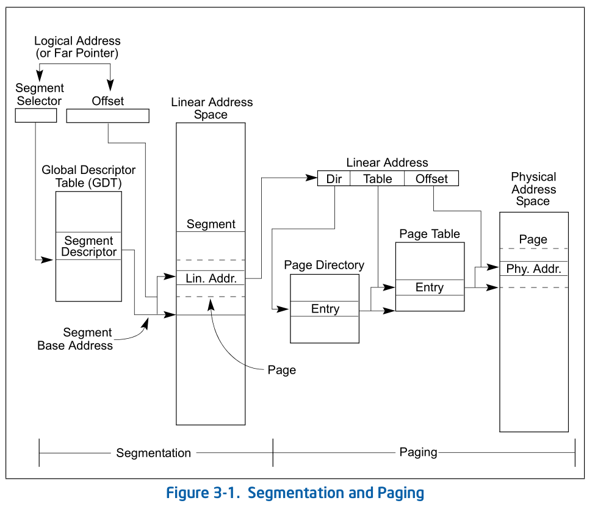
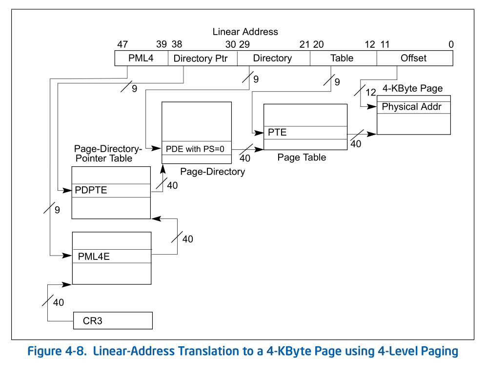
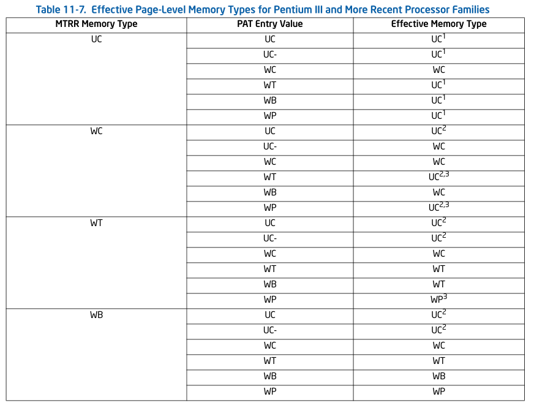

```c++
int * pa;
...//对pa进行初始化
int a = *pa;
```

一行简单的访问地址的代码，背后到底经历了哪些复杂的步骤。

以linux系统和x86cpu为例，让我们来探究一下访问内存区域的全过程。

简单来说，分为以下几步：

- 首先，需要进行地址转换，因为现代cpu大部分时候运行在保护模式下。
  - 首先是分段机制，通过段表来将逻辑地址转换为线性地址
  - 然后是分页机制，通过页表将线性地址转换为物理地址
  - 在转换的过程中，还会涉及到TLB
- 现在，cpu得到了物理地址，通过该物理地址进行访问，这会涉及到cache
- 在上面的过程中，还会遇到非法地址访问或者page fault的问题，这需要交给内核进行处理。

接下来，从上面描述到的各个步骤来深挖一下里面涉及到的东西。不过，说是深挖，但是涉及到的东西太多了，也只能浅尝辄止。

<!-- more -->

# 分段机制

首先是分段分页机制，在X86 cpu上，分段分页机制的流程如下：



- 通过段寄存器，得到它其中的段选择子（segment selector)
- 根据段选择子，从GDT表中读取出对应的段描述符(segment descriptor)，并进行检查，包括访问权限的检查和偏移是否超出段大小限制的检查
- 根据段描述符中的记录的段基址（segment base address)和对应的偏移(offset)，计算出对应的线性地址（linear address)
- 根据线性地址，去查页表，得到对应的物理地址

cpu并不是每次都要通过段寄存器的选择子去gdt表中寻找对应的段描述符，段寄存器自带影子寄存器，每当向段寄存器写入新值时，cpu会自动去gdt/ldt表中寻找对应的段描述符，将段描述符的数据拉入到影子寄存器中。以后每次访问，其实是直接使用影子寄存器的数据的。

linux内核使用的是平坦模式（flat model），这表示每个段的基址都是0，段的大小为0XFFFF..FFF，也就是全部的地址空间。不过，其实有两个段还是被使用的，分别是fs和gs段，分别用于线程局部存储和perCPU变量。

# 分页机制

现代CPU一般使用的是4级页表，分别是pgd、pud、pmd和pt。如果使用的是5级页表，那么在pgd和pud之间还多了一个p4d。注意，以上几级页表的说法都是来自linux内核，在intel手册上，它们被称作PML4E、PDPTE、PDE和PTE。



多级页表的起始位置，是cr3寄存器。cr3寄存器存放着pgd表的物理地址，pgd表中的每一项存放着pud表的物理地址，依次类推，直到pt的每一项存放的是页框的物理地址。

以上是关于页表最基本的概念，x86的页表中的细节非常多，具体可以看intel手册卷3第4章，这里简要介绍一下页表项的某些字段的含义。

- P标志位，present的意思，如果为0，暗示对应的物理页所容纳的数据不在内存中，需要换入
- R/W位，read/write，该位为0时，说明该页不可写。这与COW机制以及只读内存有关。
- U/S位，user/supervisor，如果是0，则说明用户态下不可以访问该页
- A位，Accessed，当CPU访问过这块内存区域后，会将该位设置为1
- D位，dirty，如果cpu有向这块内存区域写过数据，则会将这位设置为1
- PS标志位，这个与大页机制有关。上图中的页表中的每个页是4K的，不过X86 CPU支持2M和1G的大页，怎么做呢？很简单，如果是2M大页，那么在pmd这一级就结束，直接指向具体的页框，如果是1G大页，那么在pud这一级就结束。怎么告知CPU地址转换在某一级就结束呢，通过设置页表项的PS位，该位为0表示还有下一级页表。
- protection key，位于第62-59位，这与X86新的保护方式PKRU有关
- PWT/PCD/PAT三位，这三位与内存的cache方式有关。关于这三位的描述见cache小节
- XD位， execute-disable，可执行权限。

从上面的字段描述，我们能发现许多与内核相关的东西，比如换页机制，fork的COW标志等等。

# TLB

TLB全称Translation Lookaside Buffers。

这里先解释几个概念：

- page number，线性地址的页号，即线性地址的高x位，x取决于一个page是多大，比如64位的四级页表，
  - 如果页为1G大小，那么page number就是线性地址的第47-30位
  - 如果页为2M大小，那么page number就是线性地址的第47-21位
  - 如果页为4K大小，那么page number就是线性地址的第47-12位
- page frame，物理地址的页号，即物理地址的高x位，x同样取决于一个page有多大
- page offset，物理地址或者线性地址的低x位，x同样取决于一个page有多大，比如page为4K，那么就是低12位

x86 cpu在TLB中缓存以page number作为索引，存储了以下信息：

- 对应的物理地址
- 与这个物理地址有关的中间几级paging-structure entry（指pgd、pud、pmd表项）的部分信息，包括
  - R/W位
  - U/S位
  - XD位
  - protection key
- 最后一级的paging-structure（指pt的表项或者pud、pmd的表项，取决于页是多大的）的相关信息，包括
  - D位
  - PWT/PCD/PAT三位


当访问一个地址时，会先在TLB中寻找对应的物理地址，如果找不到，那么就需要从CR3寄存器出发，一级一级地往下找，这个过程称之为page walk。

当CPU将某个地址映射信息加入到TLB中时，会将每一级页表中对应表项的A位置1（如果之前这一位不是1的话）。

关于TLB的话题还有很多，比如PCID、global page、TLB shootdown甚至于data TLB和instruction TLB。这个有时间再来展开。

# cache

现代CPU的cache不像计算机组成原理课程中描述的那么简单了，具体模型复杂的多。这里，我们不再讨论什么直接映射、组相连之类的话题，现在的CPU用的是组相连。

首先，有三级cache，也就是L1、L2和L3。其次，现代cpu有多个核心，每个核心有自己的cache，这就带来了cache的一致性问题。最后，cache的缓存方式有好几种，怎么确定使用哪一种。

首先是cache的组织结构和一致性问题的解决。

首先先区分一下CPU中的几个概念。

## 关于cpu中的各个名词

- cpu package，市面上买到的一块CPU称为一个CPU package
- CPU socket，在主板上CPU package的一个插槽，用作CPU与主板的通信，一个cpu socket与一个cpu package配对。一个主板上可以有多个CPU socket，民用PC通常只有一个CPU socket，服务器上可以有至多8个CPU socket，也就是8路。有时socket也用来指代package。
- CPU die，这是CPU生产工艺中引入的概念，一个晶圆在上有很多的Die，光刻机将电路逻辑蚀刻在Die上，然后将这些Die切割下来。对于intel和amd，它们将这些1个或N个cpu die封装到一个cpu package中。对于intel Xeon系列，这类高端处理器尽可能在一个cpu package中仅封装一个cpu die，这样cpu内部的各个组件就能通过片内总线相连，整体性能更好。而AMD的EYPC CPU，每个package中有4个cpu die，cpu die之间通过片外总线（Infinity Fabric）相连，性能较低。AMD的EYPC CPU，每个die之间之间不能共享cpu cache，而单个die的 intel Xeon内cpu core可以共享L3 cache。
- core/physical processor/processor core，一个core包含了完整的CPU流水线部件，一个cpu die中包含了若干个core。
- hyper-thread/logical processor，一个core上一般能够虚拟出2个（也有更多的）hyper-thread，也就是两个超线程。超线程是物理线程，与编程时的thread这种软件线程的概念不同。超线程出现的原因是因为cpu流水线很多时候某些单元是空闲的，这时候让这些单元去执行另一个线程的任务，可以有效提高cpu的利用率，提升性能。

## cache的结构

以i3、i5、i7为例，每个core拥有自己的L1和L2，一个package中所有的core共享L3。L1还会被细分为指令cache和数据cache。

一个computer中所有的cache，通过MESI协议保证一致性，CPU package之间的cache由snoop机制来实现cache一致性。对于这个概念，我的理解是这样的：cache一致性由MESI来保证，一个package之间通过片内总线来实现cache一致性，package之间通过监听总线来保证一致性，也就是snoop机制。而snoop机制只是MESI协议其中的一环。

另外，除了L1、L2和L3，为了加快将cache上的数据写入到内存上的速度，X86 cpu还引入了一个store buffer。Intel 64和IA-32处理器将要写往内存上的数据放到store buffer上。store buffer可以使得执行写内存的指令不需要等到数据一定要写到内存上后才返回，而是写到store buffer上后就可以返回了。而store buffer在满足某些条件时数据会被自动刷到内存上，这能够提高性能，也能使得处理器r更有效率地使用总线周期。

## MESI协议

上面提到了MESI协议，这其实是四个状态的开头字母的缩写，分别是modified、exclusive、shared、invalid。

除去L1的指令cache外，每个cache中的cache line都拥有上述四种状态中的一个。四个状态之间会进行转换（其实就是状态机）。

当一个内存上的数据被拉入到某一个cpu的cache上时，这时候该cpu将其状态标记为E，也就是独占。

接下来，另外一个cpu也要将这个数据拉入到自己的cache中，它可以通过总线发现另一个cpu的cache中有数据，于是它从另一个cpu的cache中读取数据，两个cpu的cache都将对应的cache line的数据标记为S，即共享。

接下来，其中一个cpu向该内存区域写入数据，那么这个cpu会将对应的cache line的状态标记为m，即已修改，而另一个cpu的cache line的状态将变为invalid。

关于MESI还有许多的细节，上面只描述了一小部分，具体的协议内容可以到网上搜。

## memory type

组成原理的课程已经讲过，cache的写回方式有许多，比如write back、write through（这些被称为memory type）等等，那么这些在现代CPU上到底是怎么工作的呢？

这里介绍一下X86 CPU上有多少种memory type。

先介绍一个概念，memory location，如果经常翻各种文档，这个概念一点都不陌生（比如cppreference上就提到过它），但是具体的中文概念我也解释不清楚，理解为要访问内存中的某个数据即可。

- strong Uncacheable(UC)， memory location不会被缓存，所有的读写都走总线，以程序中定义的顺序（program order）访问，不会有CPU乱序。不会有分支推测执行、内存推测访问和page walk。通常用于memory-mapped I/O devices，用在普通内存上会极大影响性能。

- Uncacheable(UC-)，和UC相同，但是内存类型（memory type）可以通过MTRRs来重写（override）为WC类型。关于MTRR的概念见后文。

- Write Combining(WC)，memory location不会被缓存（与UC一样），cache一致性会有问题。允许预读上面的数据。写的数据会先被放到一个write combining buffer(WC buffer)中。WC buffer不同于store buffer，它内部由多个（6个、8个或10个）buffer组成，每个buffer大小为32或者64字节（取决于CPU型号）。当要向一块WC类型的内存区域写数据时，CPU会将数据先写入到WC buffer中。当一个buffer要被淘汰时，再将它的数据刷下去（刷的方式有有讲究，这里不再详细描述了）。WC buffer没有snoop机制，因此不保证数据一致性。write combining可以与任意类型的memory type组合，对于UC类型的内存来说，它能大大提高性能。

- Write-through(WT)，读和写都有cache。读cache miss会引起cache fill。写操作会写穿到内存，其中多级cache中对应cache line要么被无效，要么也被写上数据，如果某级cache没有对应cache line，是不会引起cache fill的。这一类型适用于frame buffer（只映射到内存中用于显示的内存），或者那些总线上有其他设备访问内存，但是并没有用snoop机制的内存区域。

- Write-back(WB)

  读和写都有cache。读写cache miss都会引起cache fill。写的数据会暂时放在cache line中，直到这个cache line要被淘汰时才刷下去。这有效减少了bus traffic（即减少了总线争用），但是要求所有访问内存的设备都要snoop以保证一致性。

- Write protected(WP)

  读操作尽可能尝试从cache line上读，读失败会引起cache miss。写操作会通过系统总线写下去，并且无效化其他所有processor对应的cache line。

## MTRR和PAT

上面介绍了这么多种memory type，那么cpu怎么知道哪块内存区域应该使用哪种cache方式呢？答案是通过MTRR和PAT机制。

MTRR， MEMORY TYPE RANGE REGISTERS，这是一系列MSR寄存器。什么是MSR寄存器呢，简单理解就是X86提供的一堆需要使用特殊指令才能访问的寄存器，而不像rax，rbx等直接可以在MOV等指令中可以直接用的寄存器。

通过MTRR寄存器，可以设置每一段物理内存区域使用哪种memory type。由于MTRR寄存器的数量有限，所以只能够粗粒度设置每个内存区域的memory type，而且可设置的物理内存区域的大小也有限（从intel手册上看，应该是不能够超过4G范围，也就是说，4G以上的空间无法通过MTRR来设置memory type）。

PAT是X86新引入的一套机制，使得用户可以按照页为粒度设置memory type。在分页机制那一节中，我们提到PWT/PCD/PAT三位，这三位正是用于PAT机制。简单来说，PAT有一个表，这个表共8项，每一项可以配置为上面提到的memory type中的一种。而PWT/PCD/PAT三位正是用来当做索引，在这个表中进行查找，以决定它们的属性。系统在启动时会为这个表赋初值，使得PWT/PCD的行为刚好如它们的名字一样，用来控制该页的write through和cache disable。

由于同时存在MTRR和PAT两套机制，而每一套机制又可以独立设置memory type，那么极有可能两套机制设置的memory type不同，而真正的memory type由二者共同决定，表格如下：



## 其他

上面仅粗略描述了X86 cache的相关信息，实际上还有许多细节，如内存序、原子操作等等一系列机制，这些有时间再展开。

# page fault

在页表寻址的过程中，可能会遇到不符合条件的页表，这时会触发page fault或者其他系统中断。对于内存管理这边来说，最关注的就是page fault这个中断处理程序了。本小节将从cpu层面和内核两个方面来探究page fault的具体细节。

## CPU的page fault

一般来说，有两种情况会触发page fault：

- 访问的线性地址没有对应的物理地址
- 访问的线性地址有对应的物理地址，但是访问权限不对。

page fault在X86上的中断号是14，属于cpu保留中断。手册上有详细描述哪些情况会触发page fault（位于intel 手册卷3第6.15小节），这里简要翻译一下：

- 多级页表中任意一级页表项的P标志位被清零0，都会引发page fault。这代表数据不在对应的物理内存中。
- 当前程序对要访问的页没有足够的访问权限，也会引发page fault。比如处于用户态的程序要访问处于内核态的地址空间。另外，SMAP和PKRU机制也会引发page fault（这两个机制有时间再展开）。
- 在用户态的代码想要写一块read-only的页。另外，如果CR0.WP为1，在内核态想要写一块read-only的页也会触发page fault（这个是WP机制，有时间再展开）。
- 在取指时取到了一块不可执行的页上的数据
- 页表项中有些reserve位被设置成了1（reserve位必须为0）
- 访问线性地址时违反了某些特殊的访问权限要求

在发生page fault后，cpu会提供error code来表明是哪种情况触发的page fault，并且在CR2寄存器中保存触发page fault的线性地址。另外，中断上下文在保存现场时，保存的CS和EIP寄存器信息指向触发page fault的那条指令的位置。

## 内核对page fault的处理

### spurious_fault

有时候内核会把某些RO（只读）的页改为RW（读写），理论上这时候应该刷这些页的TLB表项，但是这一开销太大了，内核并没有刷。这样，当代码写数据到某些从RO变为RW的页时，由于TLB还残留有修改前的信息，因此CPU认为访问权限不对，触发page fault。在page fault的处理例程中，先查看这些页是否是可写的，如果是，则这一次page fault例程不需要干什么事。同时，这次page fault也会触发cpu刷新关于该页的TLB表项。

### exception table

这一节的具体知识可以参考/Documentation/x86/exception-tables.txt

许多系统调用都会传递用户态缓冲区给内核，比如read、write。在内核中，为安全起见，需要检查这些传进来的缓冲区的读写权限是否是符合要求的，linux的老做法是调用verify_area，通过判断这些传进来的缓冲区对应的vma的权限是否将要指向的操作相容，但这个太吃性能了，而且在某些有bug的程序中会有问题。

新的做法是使用access_ok、get_user之类的函数，这套机制使用了exception table。这是非常有意思的一个东西，解释起来有点复杂，但是内核有些其他机制也用上了类似的思想，如ftrace，值得细细深究。

以get_user(x, ptr)（这个宏函数接受两个参数x和ptr，ptr是用户态地址，从其上读取数据，读取到的数据放到另变量x中，如果读取失败，则返回-EFAULT）为例，GCC编译出来的汇编代码如下（这个是get_user在只读1个字节的汇编代码）：

```assembly
        xorl %edx,%edx
        movl current_set,%eax
        cmpl $24,788(%eax)
        je .L1424
        cmpl $-1073741825,64(%esp)
        ja .L1423
.L1424:
        movl %edx,%eax
        movl 64(%esp),%ebx
#APP
1:      movb (%ebx),%dl                /* this is the actual user access */
2:
.section .fixup,"ax"
3:      movl $-14,%eax
        xorb %dl,%dl
        jmp 2b
.section __ex_table,"a"
        .align 4
        .long 1b,3b
.text
#NO_APP
.L1423:
        movzbl %dl,%esi
```

抛却前面一堆复杂的代码，从注释#App下的那一行开始，

- 标签1对应的代码是访问用户态的地址指向的内存。
- 接下来只留了一个标签2
- 再往下的几行汇编代码被放到了.fixup段，这是内核代码自己定义的段，这三行汇编代码做的工作是往返回值中填写-14（-EFAULT对应的值），将dl值清零，然后跳转到标签2的位置
- 再往下是在段__ex_table中放了一项数据，这项数据以标签1的地址为key，以标签3的地址为value
- 再往下又切换到了.text段，将dl的值放到放到变量x中，这行汇编代码是紧接着标签2的。


当指向标签1所对应的代码时，可能会触发page fault（因为这是用户态传递进来的地址，可能不合法），这时，在page fault的处理例程中，会判断到这一情况，然后去`__ex_table`中找到标签1对应的那一项，这样，就找到了标签3对应的地址，然后，page fault处理例程在返回时不会像正常的返回一样跳转到引发page fault的那一行重新执行，而是跳转到.fixup段对应的那几行地址上去执行。

再捋一捋流程，如果是page fault，相当于从标签1跳转到标签3，填写了-EFAULT错误码，清空了dl寄存器，然后跳转回标签2，将dl寄存器的数据填到变量x中，这相当于告知调用者`get_user`传递的地址是不可访问的。

如果没有触发page fault，则很简单，标签1的代码执行后直接到最后一行汇编指令，将访问到的值拷贝到x中。

### vmalloc fault

vmalloc是内核中用来分配大块虚拟地址连续的内存空间的接口。内核地址空间共享这个特点在各种书籍上都有提到过，但是是怎么实现的呢。

- 首先，在fork一个进程时，要为它创建页表，在新分配的pgd表中，内核将父进程的关于内核的那部分地址空间的pgd表项直接拷贝到了新的pgd表中，这样，新的进程就能够通过自己的页表访问到内核空间了。
- 这个机制有一个漏洞，假如进程A fork出了一个进程B，然后，进程A在内核中调用了vmalloc，这可能会导致内核地址中的某个空pgd表项被填写，这样，进程A就能访问新vmalloc的地址空间了。接下来，进程B也拿到了vmalloc出来的地址空间，准备进行访问，但是它的页表中没有做这个地址的映射，没办法访问。

所以，page fault作为填补这个漏洞的补丁。首先，进程A在vmalloc的时候，它会修改init_mm中对应的pgd表项。接下来，进程B在访问vmalloc出来的地址时，因为它的页表没有填写，所以会引发page fault，在page fault的处理例程中，它发现这个引发page fault的地址空间时vmalloc区域的，它就会去init_mm对应的pgd表中进行查找，然后发现init_mm中的pgd表已经做了映射，于是它把对应的表项拷贝到自己的页表中，这样，进程B也能进行访问了。


### mmap

mmap用于用户态程序告诉内核，某部分虚拟地址空间将被用户程序使用，一旦出现page fault，就做相应的工作将这块空间变成可访问，而不是直接segment fault。当然，也有可能引发segment fault，比如写到了一块映射常量数据的地址空间。

#### stack fault

在执行execv系统调用时，内核会为进程创建一个vma，作为用户态的栈。在一开始，内核只为这个栈分配一页的空间（vma描述的空间也只有一页大小）。进程在运行时会突破这一页的限制，从而引发page fault，这时这种情况会被内核检测到，然后为这一vma扩容，以便它能够容纳下引发page fault的这个地址，不过，栈的大小默认情况下不能超过8M（在/proc/id/limits中可以看到），如果引发page fault的地址虽然在栈的附近，但是超过了8M大小，这会被内核认为是stack overflow。

#### file

mmap是可以映射一个磁盘文件的，说是映射文件，实际上是把文件的page cache中的那些page给映射到用户进程。当踩到这样的一块虚拟地址空间时，需要由文件系统将对应页的数据从磁盘中拉上来。

#### cow

fork是cow的，这个在将操作系统的API上都讲过，那么是怎么做的呢。在fork的时候，会将父进程页表中的所有最后一级页表项从读写变为只读，在创建子进程的页表项时，中间几级的页表(比如pud、pmd)不是使用的父进程的，而是单独为它分配的。只有最后一级的页表项（pte）是指向了父进程的那些物理地址，并且也是标记为只读的。

这样，无论是父进程还是子进程，一旦要写某块内存，就会触发page fault，这时候内核再为该进程分配一块物理页，然后将原来物理页的数据拷贝到新的页面中，接下来再修改映射。

#### 惰式分配内存

在调用mmap进行匿名映射时，如果不指定populate选项，那么默认是不为该地址空间分配物理页的，而只是在vma的红黑树中做个登记。在后续的访问中，必定会触发page fault，这时再为其分配物理页，并填写页表。

### 其他page fault

#### mmiotrace，kprobe

这些是内核提供的一些用于debug的工具，它们也使用到了page fault，具体原理不详，有兴趣的可以自行搜索。

### hugetlb fult

与大页映射有关。

#### SMAP及其他cpu机制引起的fault

SMAP机制

上文提到过，如果页表项的reserve标志位为1，也会引发fault。

### vsyscall

vsyscall也有可能会引发page fault，这个没有研究过，不清楚

### 指令预取时触发page fault

这个也没有研究过，待填坑

### f00f bug

这是个cpu能自己把自己锁起来的bug，哈哈哈。也是用page fault来解决的。

### K8 erratum #100和#93

`#100`的漏洞，直接看英文吧：Work around K8 erratum #100 K8 in compat mode occasionally jumps to illegal addresses >4GB.

`#93`的漏洞，不清楚，感兴趣的可以搜一搜

### 内核的page fault处理流程

- 如果是mmiotrace的page fault，处理后返回
- 通过CR2寄存器，可以知道是哪个地址引发的page fault。通过这个地址，可以判断地址是内核态还是用户态的。
- 如果是内核地址
  - 如果是vmalloc引发的page fault，处理之
  - 如果是spurious fault，处理之
  - 如果是kprobe fault，处理之
  - 否则，转到bad_area_nosemaphore函数，见后文
- 否则是用户态
  - 如果是kprobes fault，处理之
  - 如果是reverse标志位为1造成的，则是内核出问题了，内核oops
  - 如果是smap fault，转到到bad_area_nosemaphore
  - 如果内核关掉page fault的响应，却引发了page fault，或者在中断上下文中引发的page fault，bad_area_nosemaphore
  - 接下来，找到对应的vma进行处理
    - 如果没有找到vma，或者找到的vma在地址上与触发page fault的不符，则调用bad_area，这个函数最终也转到了bad_area_nosemaphore
    - 如果是stack fault，处理之
    - 如果是上面提到的关于mmap的vma的fault，则按照对应的方式处理之


bad_area_nosemaphore函数

- 如果是在用户态触发的page fault（注意，不是指地址在用户态，而是在用户态时触发了page fault）
  - 如果是预取时的page fault，处理之
  - 如果是K8 erratum #100 bug，处理之
  - 如果是vsyscall引发的fault，处理之
  - 现在，确定是错误地址访问了，给进程发信号，干掉它
- 如果是在内核态引发的page fault
  - 如果是f00f bug，处理之
  - 如果是uaccess、get_user之类的exception table相关的page fault，处理之
  - 如果是内核的stack overflow引发的page fault，处理之
  - 现在，确定是内核态的错误地址访问了，炸掉内核，oops

